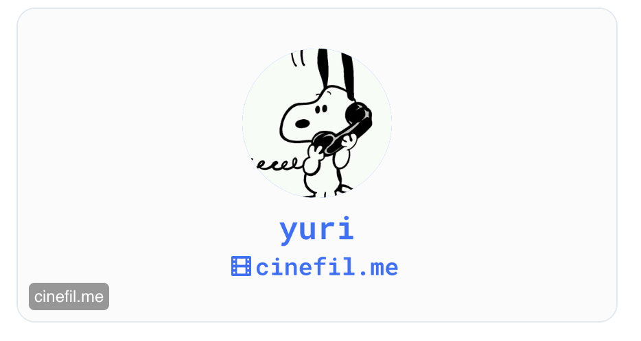

# OG Image Handler for Cloudflare Workers + Hono

Dynamic OG (Open Graph) image generator for Cloudflare Workers with Hono.



## Features

- Dynamic image generation based on database queries
- Customizable styles and layouts
- Font loading support
- Error handling with fallback images
- TypeScript support
- Separated component structure for better maintainability

## File Structure

```
hono-og-image/
├── og-handler.tsx    # Main handler with ImageResponse logic
└── og-image.tsx      # React components for OG image templates
```

## Usage

1. Copy both `og-handler.tsx` and `og-image.tsx` to your project
2. Update the `Bindings` import path to match your project structure
3. Modify the database query to match your table structure
4. Change the font path to your font file
5. Customize the design and text content in `og-image.tsx`

## Customization

### Bindings Type

Update the import path in `og-handler.tsx`:

```ts
// Change this to match your project structure
import type { Bindings } from "../types/server";
```

Your `Bindings` type should include:

```ts
type Bindings = {
  DB: D1Database;          // Your database binding
  SITE_URL: string;        // Your site URL
  // ... other bindings
};
```

### Image Size

Change dimensions in `imageOptions`:

```ts
const imageOptions = {
  width: 1200,  // Change width
  height: 630,  // Change height
  // ...
};
```

### Styles

Customize colors and layout in `baseStyle`:

```ts
const baseStyle = {
  backgroundColor: "#fbfbfb",
  color: "#326cfe",
  fontFamily: "Roboto Mono",
  // ...
};
```

### Data Source

Replace `c.env.DB` with your database binding:

```ts
const result = await c.env.YOUR_DB_NAME
  .prepare(`SELECT * FROM your_table WHERE id = ?`)
  .bind(id)
  .first();
```

### Font

Update font URL, name, and weight:

```ts
const fontData = await fetch(
  new URL(`${c.env.SITE_URL}/fonts/YourIdealFont.ttf`, import.meta.url)
).then((res) => res.arrayBuffer());

const imageOptions = {
  // ...
  fonts: [
    {
      name: "YourIdealFont",
      data: fontData,
      style: "normal",
      weight: 600,
    },
  ],
};
```

### Components

Customize the React components in `og-image.tsx`:

**OgImageFallback** - Displayed when no data is available:

```tsx
export function OgImageFallback({ styles }: OgImageFallbackProps): ReactElement {
  return <div style={{ ...styles }}>Your Site Name</div>;
}
```

**OgImage** - Main OG image template:

```tsx
export function OgImage({
  baseStyle,
  avatar,
  displayName,
  siteUrl,
}: OgImageProps): ReactElement {
  // Customize layout, colors, sizes, etc.
  return (
    <div style={{ ...baseStyle, /* your custom styles */ }}>
      {/* Your custom content */}
    </div>
  );
}
```

## Example

```tsx
import { getOgImageHandler } from "./og-handler";

app.get("/og-image", async (c) => {
  return await getOgImageHandler(c);
});
```

Visit `/og-image?userId=123` to generate the OG image.

## Requirements

### Runtime Dependencies
- `@cloudflare/pages-plugin-vercel-og` - For ImageResponse API
- `hono` - Web framework

### Type-only Dependencies (devDependencies)
- `react` (^18.3.0) - For JSX type definitions only
- `@types/react` (^18.3.0) - React type definitions

**Note**: React is used for type checking only. The runtime is provided by `@cloudflare/pages-plugin-vercel-og`.

## Installation

```bash
# Install runtime dependencies
npm install @cloudflare/pages-plugin-vercel-og hono

# Install type dependencies (optional, for better DX)
npm install -D react @types/react
```

## TypeScript Notes

If you see type errors when opening these files standalone:
- Install `react` and `@types/react` as devDependencies
- Or add `// @ts-nocheck` at the top of the file

These are type-only imports and won't be included in the bundle.
